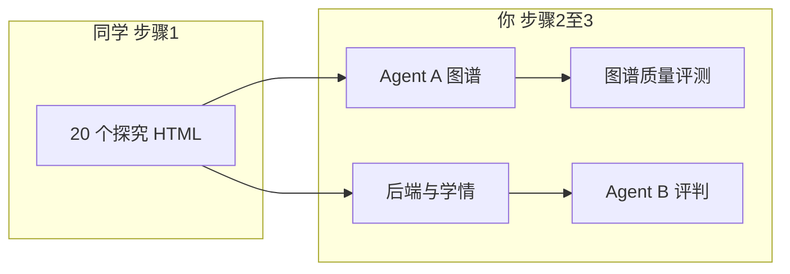
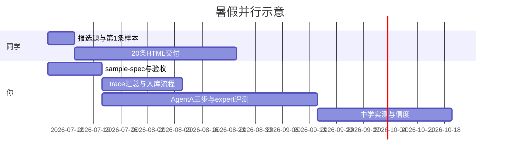

# 物理探究平台 · 三期方案

> 依据 2026-07-05 会议转写、[`我整理的思路.txt`](我整理的思路.txt)、组内分工说明与当前代码库对照编写。  
> **创新点**在「代码 → 物理模型 → 变量 → 单变量优先级 → 事理图谱」及图谱质量评测，**不在** AI 自动生成精美游戏。

---

## 项目总流程（三步）

| 步骤 | 内容 | 负责人 |
|------|------|--------|
| **① 制作样本** | 探究教育游戏（单 HTML）；含过关目标、混淆变量、探索/竞赛模式等 | **5 名同学 + 崔**（暑假，共 20 条，约每人 4 条） |
| **② 自动分析** | Agent A 从游戏代码剥离物理模型与变量关系，生成事理图谱；图谱准确性验证 | **你**（平台 + Agent A 管线，Cursor） |
| **③ 试玩评判** | 学生试玩 → 轨迹上报后端 → Agent B 按图谱评判探究过程 | **你**（平台 + Agent B + 后端）；中学实测由导师协调 |



**你当前主线：** Agent A 以 **分析源码** 为主路径（设计轨为辅）；同学做样本的同时，你继续完善 **步骤 2、3** 的平台与 Agent 能力；样本入库后接分析轨批跑。

---

## 分工一览

### 同学组（5 人 + 崔）— 仅负责样本

| 事项 | 说明 |
|------|------|
| **交付物** | 20 条探究游戏 HTML（单文件或可放入 `packages/{id}/game.html`） |
| **配额** | 约 **每人 4 条**；组内先报选题，**避免重复** |
| **知识点** | 高中或大学物理均可（最终给**初中生**试玩，不要求会公式） |
| **制作方式** | 三选一或组合：**从零做** / **润色已有** / **改 PhET、NUSEP 开源仿真** |
| **必改项** | 仿真 → 探究游戏：加**无关混淆变量**、**明确过关目标**（如打靶）；**探索/竞赛双模式由平台壳统一提供**（样本无需自建血槽） |
| **参考资源** | [PhET](https://phet.colorado.edu/)（科罗拉多开源）、[NUSEP](https://nusep.tsinghua.edu.cn/)（清华，论文需 acknowledgement） |
| **进度** | 暑假完成；**本周每人至少完成 1 条** 可试玩 HTML |
| **不做** | Agent、图谱、后端、评判逻辑（交给你集成） |

同学交付前对照 **`docs/advisor/sample-spec.md`**（由你编写）自检；你验收后写入 `data/runtime/packages/` 并登记 manifest。

### 你 — 平台、Agent、规格与集成

| 事项 | 说明 |
|------|------|
| **样本规格** | 编写 `sample-spec.md`、验收表、埋点约定；指导同学改 PhET/NUSEP |
| **平台** | 教师/学生端、catalog、轨迹采集、学情、资源管理 Tab（已有基础） |
| **Agent A** | 分析轨三步：物理模型 → 变量 → **单变量优先级** → 事理图谱 |
| **图谱质量** | 专家 gold、F1、优先级 Spearman；批跑 20 条 |
| **Agent B** | 轨迹对齐、路径打分、跨游戏汇总（随三期增强） |
| **后端** | 参数调整次数汇总、phase、导出；可选 DB |
| **实测协调** | 与导师/中学渠道对接；不负责替同学做 HTML |

---

## 现状与缺口（技术侧，主要由你补齐）

| 维度 | 目标 | 现状 | 缺口 |
|------|------|------|------|
| **游戏样本** | 20 条符合规格 | 仓库内约 20 条 Agent 样作底稿；同学暑假新做/改 PhET | 同学并行产出；多数仍缺混淆/显式 win；双模式已由平台壳交付 |
| **图谱生成** | 三步 + 单变量分支 | 设计轨/分析轨已有 Parse | **priorityRank**、斜抛 few-shot、每参单变量 route |
| **图谱质量** | 专家 F1 + 优先级 ρ | 内部 quality checklist | 无 expert gold 批跑 |
| **测评** | 多游戏信度 | Agent B 单 session | 跨游戏聚合、中学场域 |
| **后端** | 各参数调整次数 | 全事件 trace | 会话级汇总字段 |

**你已完成的平台项：** 轨迹 iframe 注入、操作提示去重、资源管理 Tab、trace hook。

---

## 样本来源（同学执行，你定标准）

| 来源 | 建议 | 说明 |
|------|------|------|
| **PhET / NUSEP** | 优先推荐 | 物理引擎可靠；加靶心、血槽、混淆滑条；论文致谢 |
| **现有仓库样本** | 同学可认领润色 | `data/runtime/packages/` 作起点 |
| **从零开发** | 允许 | UI 可极简，机制须完整 |
| **时光世界等** | 仅参考 UI | 缺混淆，勿原样入库 |
| **电容纪元整包** | 展示用 | 不进精华清单；拆章 ch1/ch2/ch4 已作组员试点入库 |
| **精华样本数** | 可扩展 | 约 20 起，不锁死；组员目录须全覆盖 |

### 统一样本规格（你撰写 `docs/advisor/sample-spec.md` 发给同学）

1. 调节变量 ≥2；至少部分样本含 **混淆变量**（控件存在但不影响核心结论）
2. 输出变量可观测（射程、偏转、是否过关等）
3. **探索 / 竞赛**：由**学生端平台壳**统一切换并上报 `phase_change`（样本无需自建双模式 UI）；游戏可只做玩法与过关
4. **Agent B 主评判在竞赛段**（壳层 `challenge`）；样本侧可选自带次数限制，非硬门槛
5. 控件 id 稳定（如 `s-angle`），便于你后续 traceMap 与分析轨对齐
6. 过关须可触发平台 `win`（`__emit('win')` 或等价）；交付后可由你跑 `patch-html-samples-playability`

---

## 第一期：样本到位 + 数据契约（约 4–6 周）

**目标：** 同学交齐 20 条；你完成规格、入库、轨迹契约。

### 同学（步骤 ①）

| 任务 | 说明 |
|------|------|
| 组内报选题 | 群聊对齐，避免重复 |
| 每人 4 条 HTML | 本周先 **1 条**；暑假结束前交齐 |
| 按 sample-spec 自检 | 混淆、过关目标、滑条 id、win 埋点（双模式由平台） |

### 你

| 任务 | 产出 |
|------|------|
| 编写并下发 **sample-spec + 验收表** | `docs/advisor/sample-spec.md` |
| 验收、入库、登记 catalog/manifest | `data/runtime/packages/` |
| trace **会话汇总** `controlTuningCounts` | `packages/platform/trace-store.js` |
| `phase: explore \| challenge` 由学生端壳统一上报 | `student-play.html` + sample-spec |
| 给同学 1 个 **PhET 改包示例**（可选） | 如斜抛，作 few-shot 游戏样板 |

**一期验收**

- 20 条样本齐套且可上架 student 端
- 学生试玩 → 教师端可见各参数调整次数
- `npm run check:generate` 通过

**一期清单**

- [ ] **你** `sample-spec.md` + 验收表 + 组内宣讲
- [ ] **同学** 20 条 HTML（进度表跟踪）
- [ ] **你** 入库 + trace 汇总 + phase 约定

---

## 第二期：Agent A 三步走 + 图谱质量（约 6–8 周）

**目标：** 论文方法核心；对同学交付的 20 条自动出图并评测。

> **负责人：你**（同学不参与本阶段开发）

### 2.1 分析轨三阶段

| 阶段 | 输出 |
|------|------|
| extractPhysicsModel | `physicsModel.core` |
| extractVariables | 调节 / 混淆 / 因变量 |
| inferAdjustmentPriority | `priorityRank`、单调性 |

### 2.2 斜抛 few-shot 金标准

```
StrategySelect → 单变量调整 → [调速度 | 调角度 | 调高度] → 观察 → 再测
              → 多变量调整 → 误区支路
```

- 专家图谱：`data/datasets/expert-graphs/projectile-basic.chapter.json`（你可与导师手画对齐）
- 契约：`strategy-single-var-repair.js` 每 AV 一条单变量 route

### 2.3 专家对比评测

- 脚本：`tests/scripts/batch-expert-graph-eval.js`
- 指标：节点 F1、优先级 Spearman ρ、单变量支路召回
- 报告：`data/runtime/packages/reports/expert-graph-eval.md`

**二期验收：** 20 条批跑报告可进论文表格。

**二期清单（你）**

- [ ] Parse `priorityRank` + 三步管线
- [ ] 斜抛 expert gold + few-shot
- [ ] `batch-expert-graph-eval.js`

---

## 第三期：中学实测 + 信度（约 4–8 周）

**目标：** 可选论文实验 2；验证跨游戏测评一致性。

| 任务 | 负责人 |
|------|--------|
| 后端汇总 / 可选 DB | **你** |
| 精选 5 条代表游戏定稿 | **你** 选；**同学**协助修最后一轮 HTML |
| 中学场域试玩（初中生） | **导师**协调；**你**部署与收数 |
| 信度分析脚本 | **你** |
| 教师端多 session / 跨游戏视图 | **你** |

**三期验收：** N≥30 学生 × 5 游戏；跨游戏相关可报告。

---

## 时间线与并行关系



时间压力不大时：**同学交样本** 与 **你开发 Agent** 可全程并行；二期批跑依赖样本陆续入库，不必等 20 条齐再开工（先斜抛等 3–5 条试点）。

---

## 论文叙事

1. **问题：** 从探究游戏代码自动生成可评价策略的事理图谱。  
2. **方法：** 三阶段解析 + 固定 topology + few-shot。  
3. **实验 1：** 20 游戏 agent vs 专家图谱（F1、ρ）。  
4. **实验 2（可选）：** 初中生多游戏试玩 — 过程分一致性。  
5. **Implementation：** 现有 Web 平台 + Agent A/B。

---

## 你本周优先（样本交给同学的同时）

1. 完成 **`docs/advisor/sample-spec.md`** 并群发同学 + 崔  
2. 做 **1 条 PhET/斜抛改包示例**（给同学照抄结构）  
3. 启动 **priorityRank** schema + 斜抛 expert gold 录入  

---

## 风险与对策

| 风险 | 对策 |
|------|------|
| 同学进度不齐 | 进度表；先有 5 条即可试点 Agent A |
| 选题重复 | 群聊报题 + manifest 占位 id |
| 同学 HTML 缺埋点 | 你统一 patch + 验收拒收 |
| PhET 改造不熟 | 示例包 + 文档；可爬取资源你协助 |
| 图谱 LLM 不稳定 | repair 链 + few-shot + quality 门禁 |

---

## 相关文档

- [`docs/advisor/README.md`](../docs/advisor/README.md) — 导师三要素与代码对应  
- [`docs/demo/solo-e2e-checklist.md`](../docs/demo/solo-e2e-checklist.md) — 平台闭环验收  
- [`data/datasets/html-samples/manifest.json`](../data/datasets/html-samples/manifest.json) — 现有样本索引  

---

*最后更新：2026-07-06 · 分工：样本 = 5 同学 + 崔；平台/Agent = 你*
